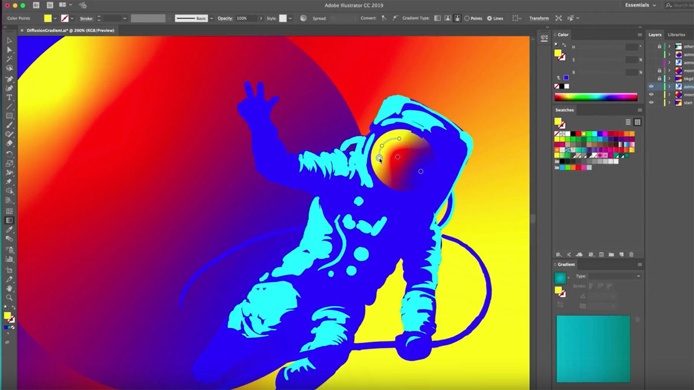

 Obey, Supreme, Diamond Clothing, Undefeated. Ever since intermediate school, I've always been interested on art and how these clothing companies create these shirts and stickers. How to they come up with ideas and make it cool. How do they get to inspire to generate something from nothing and become something you proudly wear? Being able to create something out of nothing and make it cool is a very appealing aspect that applies to being software engineer.

  Graphic Design and Software Engineer are two different names yet they share the similar idea. From brainstorming to design, from endless revisions to sigh of relief after the end product is finished. These two subjects are the same thing. The satisfaction of displaying your sticker in someones laptop is the same aspect as someone who's using that laptop is using your app. Being able to impact peoples lives in terms of fashion or a convenient way of living, that's what drives me to learn and to be a Software Engineer. Seeing people's lives brighten up from your work of art from either your artwork design in Adobe Illustrator to your Flashcard app that made studying defintion at lot more fun. Those expresssions and reactions just sends chills down my spine and happiness.

 Right now, I'm attending a college class to train students to be great software engineers. I hope I can apply my experience of being a Graphic Designer and impact as many people through coding. I want to create something out of nothing, from a blank text file, to develop an application that can hopefully change someones life or save it. Being able to express your imagination for the better
