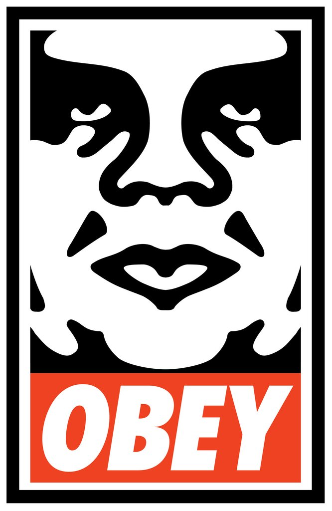

  Obey, Supreme, Diamond Clothing, Undefeated. Ever since middle school, I've always been interested on art and how these clothing companies create these shirts and stickers. How to they come up with ideas and make it cool. How do they get inspire to create something from nothing and become something you proudly wear? Being able to create something out of nothing and make it cool is a very interesting aspect that applies to being software engineer.

  Graphic Design and Software Engineer are two different names yet they share the same process. From brainstorming to design, from endless revisions to sigh of relieve after the final product is finished-- These two subjects are the same thing. The satisfaction of having your sticker in someones laptop is the same aspect as someone who's using that laptop is using your app! Being able to affect peoples lives in terms of fashion or an easy way of living, that's what make want to learn about.

  Now, I'm attending a college class about being a software engineer. I hope I can apply my experience of being a Graphic Designer and impact a lot of people through code. I want to create something out of nothing, from a blank text file, I will create an application that will change the world. If not, inspire the younger generation to surpass my designs. 
