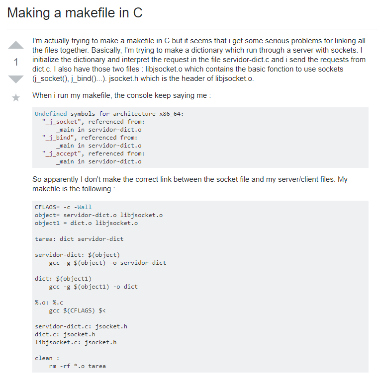

## A rant
Being a software engineer can be a time-consuming task. Every day our routine is based on how much time we can code.With this in mind, we would like to minimize the amount of troubleshooting and trying to figure out the solution to the problem. We all been where we are stuck on a code and would like to figure out why it isn't working. We always turn our heads to our best friend: Google. More specifically, StackOverflow. I've used StackOverflow since my freshman year of college at University of Hawaii at Manoa and let me tell you: that website can be a godsend for you or you just basically talking to a wall. It all depends on one thing: if the user asks a smart question.

## The good and the bad

Sometimes, questions are so easy to answer if you just search the web or read some books about it. For example, the picture above has this user ask a question about some basic operator knowledge.I’m pretty sure that 99.9 percent people who can google and read some lesson about it. Avoid asking these types of question. We don’t need to waste precious time and brain power to answer a question that you easily.These questions could pop up into questions that are like this but asking more specifically in depth like for example which operator should be using in terms of practicality. 

A good question would be represented by the picture above. It’s brief and informative, allowing the user an easier time answering the question without asking more question to the user. The user explains his problem clear and thoroughly while additionally providing the necessary information for people in the forum to gain a bigger picture with his problem. He doesn’t seem urgent and rude enough to request help and provides his mistakes that would considerably help the user what is wrong with his code. Questions like this helps the programming community as it would be one less complicated problem to solve and can be referenced to clarify other problems in the future. 

## In Conclusion
To be able ask smart questions can make your life much easier! Being straight to the point and being descriptive to ask from a fellow for help can really shed some time off from the people asking you more questions. In addition, it minimizes any confusion for your question. To be able to construct those types of questions can really benefit both sides of the party. That being replied clear response and for them not wasting more time trying to help you.
