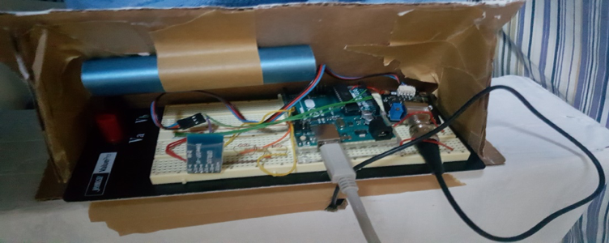
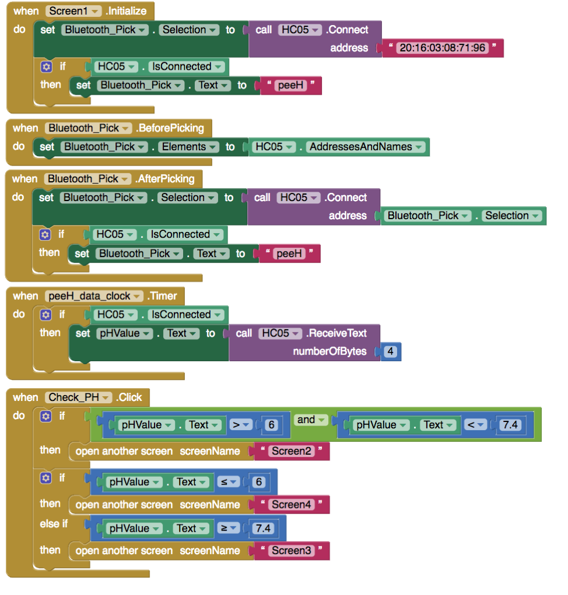

Hydration isn't as much advertised around the world. Being hydrated is a key of a healthy life style. My partner and I thought of a invention that would be a simple reminder for people to stay hydrated and drink water. How did we do it? By sticking a pH sensor in to your neighborhood urinals! Your urine actually gives precious data on how your body is doing and knowing if your urine is acidic or basic. This data would be read by the pH sensor and sends the data via bluetooth to an Andriod Device which will tell you if you are hydrated or need to go see the doctor.



For this project, I was the lead programmer which job was to program the system both in Arduino and MITAppInventor. To begin coding, I had to learn how to code with Arduino and how MITAppInventor works with Arduino. From there, I started researching how a pH sensor works with Arduino and how to code it in order to be calibrated so it senses the right values based on the liquid that was exposed to it. After the coding for the Arduino was done, I hopped to MITInventor to create a simple app that will tell the user their dehydration levels based on their urine. We tested these levels with different types of liqiud that would represent a bad pH levels (liqiuid detergent being the low pH and sprite for high pH). This communication was possible with the help of a bluetooth device that was attached to the Arduino Board that would relay the message to the Andriod Device. 


Here is some code that illustrates how we read values from the line sensors:

```js
byte ADCRead(byte ch)
{
    word value;
    ADC1SC1 = ch;
    while (ADC1SC1_COCO != 1)
    {   // wait until ADC conversion is completed   
    }
    return ADC1RL;  // lower 8-bit value out of 10-bit data from the ADC
}
```

You can learn more at the [UH Micromouse Website](http://www-ee.eng.hawaii.edu/~mmouse/about.html).


