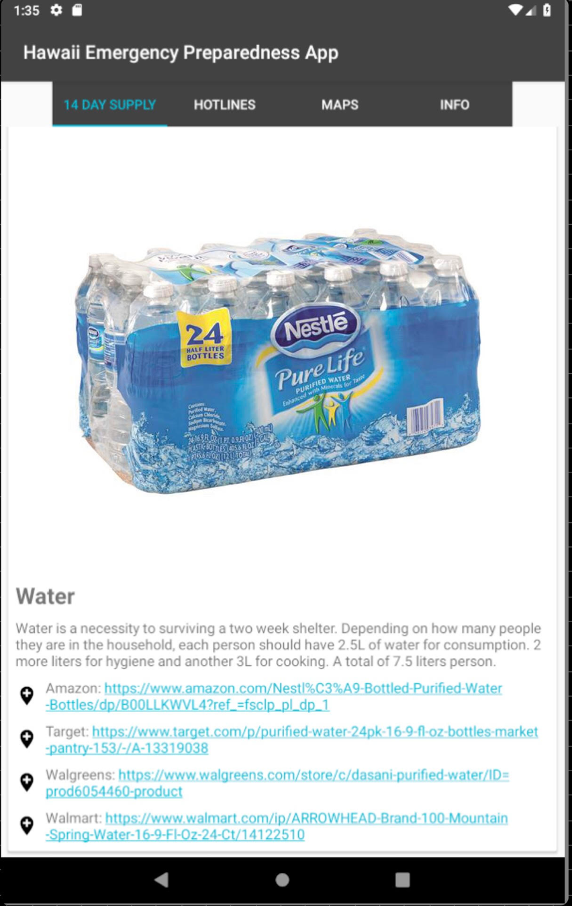

  Our project’s purpose came from the idea of recent events that happened around Hawaii. We experienced numerous threats from nuclear bombings to hurricanes. Our knowledge on how to prepare with these kinds of disaster are limited as we don’t experience these events enough. We came to an idea on creating an app that will inform the public about preparing for these disasters. This project includes a list of items based on 14-day kit that Federal Emergency Management Agency (FEMA) has provided. Also, this include a tool to gauge whether you are in the Tsunami Zone and safe zones, and hotlines that you may need just in case of an emergency. Our team consisted of two members, Japhet Ye and Marie Calamasa.  This project is done in Android Studio and GitHub as a mean of version control.
	My main task was to create the checklist of materials feature. This screen displayed the materials that is recommended to have by FEMA. Materials include water, batteries, flashlights, food, etc. This helps the user keep track of the materials in the household and provides an easy way gather materials ahead of time. This also acts as a guide on quantity since some people tend to overbuy certain things like food and water and sometimes forget things like batteries and flashlights. A feature that I would like to implement is a timer for a notification that reminded the user every month to check supplies. This is to help to see if they are expired or was used when last gathered. This helps the user since disasters are unpredictable and some people tend to forget that they need to replenish or renew supplies every so often. This allows for people to remember that they need to check up on things like canned food and batteries since these are the types of supplies that tend to be neglected to be checked up on. My secondary task was to help test and debug the program my other teammates did so our program works clean.
