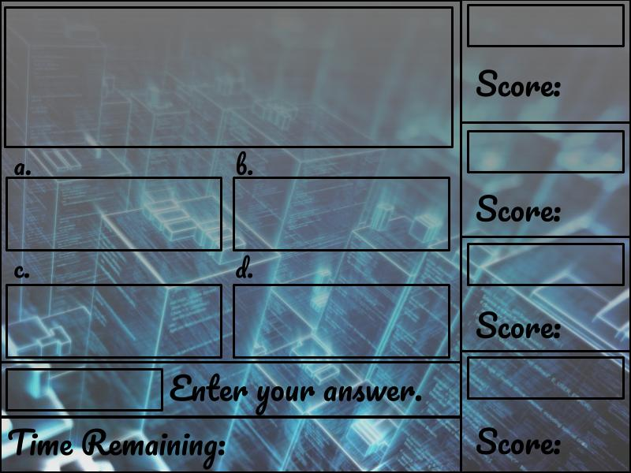

 Our final EE205 project involved working with a team of 4 individuals and using the skills learning in class and lab to create a game using object orientend programming and the use of graphic libraries to bring the game to life. My task for this project was to implement the game screen using SFML to make the game more interactive and feel like a game.

A snipet of our code of displaying our gamescreen:

 

"gamescreen.jpg"

Source: <a href="https://github.com/agasbarro36/EE205"><i class="large github icon "></i>agasbarro36/EE205</a>

